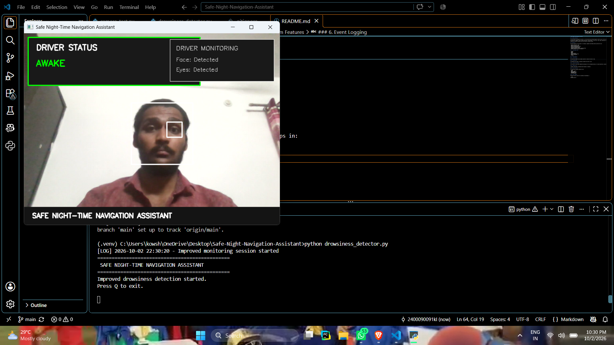
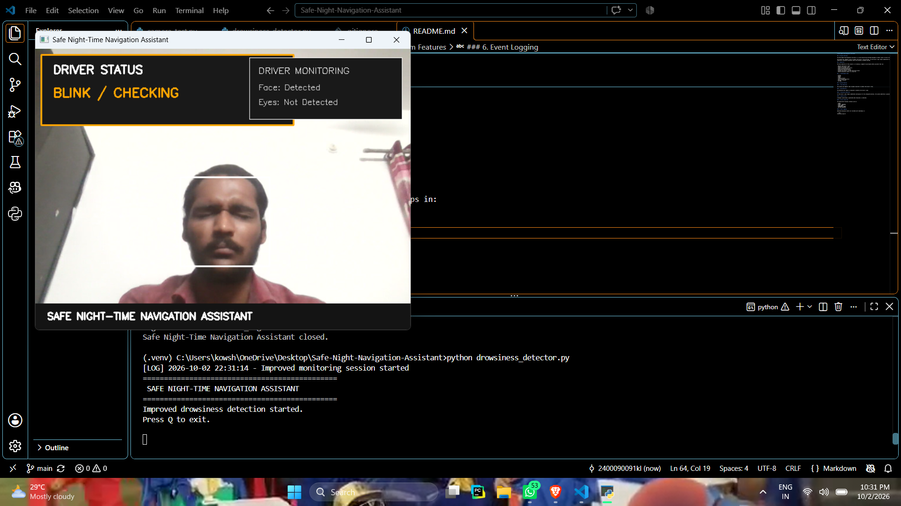
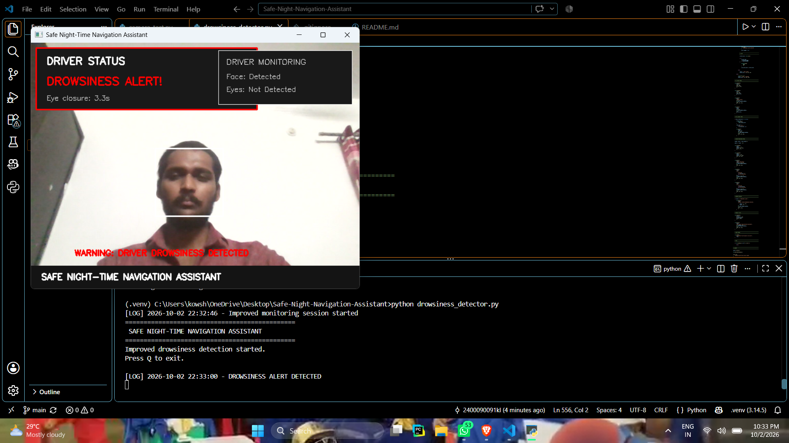
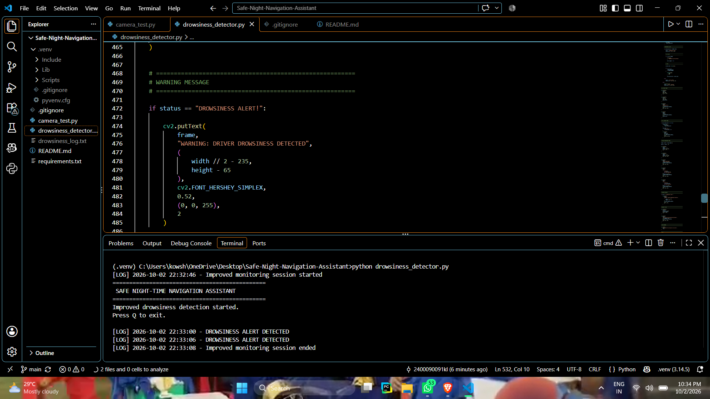

## 🧪 Testing

The prototype was tested using multiple driver-monitoring scenarios.

| Test | Scenario | Expected Result |
|---|---|---|
| T01 | Eyes open | AWAKE |
| T02 | Short eye closure | BLINK / CHECKING → AWAKE |
| T03 | Eyes closed for several seconds | DROWSINESS ALERT + Alarm |
| T04 | Face moved away from camera | NO FACE DETECTED |
| T05 | Multiple drowsiness events | Events recorded in log |
| T06 | Press Q | Application exits safely |

## 📸 Testing Evidence

### 1. Normal Driver Monitoring

The system detects the driver's face and eyes and reports the driver as awake.

### 2. Blink Detection

A short eye closure is temporarily classified as a blink/checking state rather than immediately triggering a drowsiness alert.

### 3. Drowsiness Alert

When eye closure exceeds the configured threshold, the system displays a drowsiness warning and activates the audible alert.

### 4. Event Logging

Drowsiness events are recorded with timestamps in the monitoring log.

